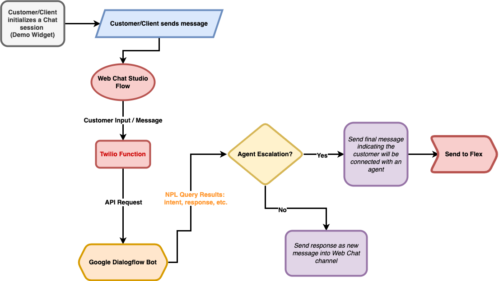

<a  href="https://www.twilio.com">

</a>

# Web Chat Agent Assist using Dialogflow

A plugin to monitor the chat in Flex to parse customer responses and forward them to a Twilio function utilizing the Google Dialogflow API. The payload returned from Dialogflow is then used to match the inferred intent of the customer message to a category of pre-canned responses for the Agent.

---

## Functionality Overview

### Technical Components

- **Twilio Serverless Function** - used to orchestrate the API requests to Google Dialogflow
- **Google Dialogflow** - given a message (text), NLP processing determines the intent of the message
- **Google Cloud Platform** - houses the service account credentials to perform authenticated API calls to Google Dialogflow from the Twilio Function
- **Redux** - used to store and perform async logic to retrieve list of pre-canned responses and NLP results from Google Dialogflow

### Diagram -- CREATE NEW DIAGRAM



---

## Setup

### Requirements

To deploy this function, you will need:

- An active Twilio account with Flex provisioned. Refer to the [Flex Quickstart](https://www.twilio.com/docs/flex/quickstart/flex-basics#sign-up-for-or-sign-in-to-twilio-and-create-a-new-flex-project") to create one.
- [Google Dialogflow Agent](https://dialogflow.cloud.google.com/) and access to the [Google Cloud Platform](https://cloud.google.com/)
- npm version 6.0.0 or later installed (type `npm -v` in your terminal to check)
- Node.js version 14 (type `node -v` in your terminal to check)
- [Twilio CLI](https://www.twilio.com/docs/twilio-cli/quickstart#install-twilio-cli) along with the [Flex CLI Plugin](https://github.com/twilio-labs/plugin-flex) and the [Serverless Plugin](https://github.com/twilio-labs/serverless-toolkit/tree/main/packages/plugin-serverless). Run the following commands to install them:
  ```bash
  # Install the Twilio CLI
  npm install twilio-cli -g
  # Install the Serverless and Flex as Plugins
  twilio plugins:install @twilio-labs/plugin-serverless
  twilio plugins:install @twilio-labs/plugin-flex
  ```

### Twilio Account Settings

Before we begin, we need to collect all the config values we need to run this Flex plugin:

| Config&nbsp;Value | Description                                                                                                                          |
| :---------------- | :----------------------------------------------------------------------------------------------------------------------------------- |
| Account&nbsp;Sid  | Your primary Twilio account identifier - find this [in the Console](https://www.twilio.com/console).                                 |
| Auth Token        | Used to create an API key for future CLI access to your Twilio Account - find this [in the Console](https://www.twilio.com/console). |

---

## Plugin Details

[TO-DO: INSERT DESCRIPTION]

### CRM Panel

[TO-DO: CRM PANEL FUNCTIONALITY]


### Toggling the Placement of the Responses

The placement of the responses is currently controlled by a `boolean` value named `crmPanelView` within `/src/ChatMessageCannedResponsePlugin.tsx`.

If this value is set to `true`, the canned responses will render to the CRM Panel:

```javascript
const crmPanelView = true;
```

If this value is set to `false`, the canned responses will render in the Chat widget beneath the text input field:

```javascript
const crmPanelView = false;
```

By default, `crmPanelView` is set to `false`.

---

## Local Development

After the above requirements have been met:

1. Clone this repository.

   ```bash
   git clone git@github.com:mschmitt19/plugin-web-chat-agent-assist.git
   ```

2. Install dependencies.

   ```bash
   npm install
   ```

3. Rename and create the `appConfig.js` file:

   ```bash
   cd public && cp appConfig.example.js appConfig.js
   ```

4. [Deploy your Twilio Function](#twilio-serverless-deployment).

5. Run the application.

   ```bash
   twilio flex:plugins:start
   ```

6. Navigate to [http://localhost:3000](http://localhost:3000).

### Twilio Serverless deployment

You need to deploy the function associated with the Web Chat Agent Assist plugin to your Flex instance. The function is called from the plugin you will deploy in the next step and returns either:

- A JSON payload containing the chat response options (`/chat-responses`)
- A JSON payload of the inferred intent from Google Dialogflow (`/gdf-bot`)

For further information on the technical functionality, please review `./functions/functions/chat-responses.js` and `./functions/functions/gdf-bot.js`.

#### Pre-deployment Steps

1. Change into the functions directory, install package dependencies, and then rename `.env.example`.

   ```bash
   # Install required dependencies
   npm install
   # Rename example env file
   cd functions && cp .env.example .env
   ```

2. Open `.env` with your text editor and set the environment variables mentioned in the file.

   ```
   TWILIO_ACCOUNT_SID=ACXXXXXXXXXXXXXXXXXXXXXXXXXXXXXXXX
   TWILIO_AUTH_TOKEN=9yyyyyyyyyyyyyyyyyyyyyyyyyyyyyyy
   ```

3. Deploy the Twilio function to your account using the Twilio CLI:

   ```bash
   cd functions && twilio serverless:deploy

   # Example Output
   # Deploying functions & assets to the Twilio Runtime
   # ⠇ Creating 1 Functions
   # ✔ Serverless project successfully deployed

   # Deployment Details
   # Domain: https://web-chat-agent-assist-gdf-xxxxxx-dev.twil.io
   # Service:
   #    web-chat-agent-assist-gdf (ZSxxxx)
   # ..
   ```

4. Copy and save the domain returned when you deploy a function. You will need it in the next step.

If you forget to copy the domain, you can also find it by navigating to [Functions > API](https://www.twilio.com/console/functions/api) in the Twilio Console.

> Debugging Tip: Pass the `-l` or logging flag to review deployment logs.

### Flex Plugin Deployment

Once you have deployed the function, it is time to deploy the plugin to your Flex instance.

You need to modify the source file to mention the serverless domain of the function that you deployed previously.

1. In the main directory rename `.env.example`.

   ```bash
   cp .env.example .env
   ```

2. Open `.env` with your text editor and set the environment variables mentioned in the file.

   ```
   # Paste the Function deployment domain
   REACT_APP_SERVICE_FUNCTION_URL=https://web-chat-agent-assist-gdf-xxxxxx-dev.twil.io
   ```

3. When you are ready to deploy the plugin, run the following in a command shell:

   ```bash
   twilio flex:plugins:deploy --major --changelog "Initial Canned Chat Responses Plugin" --description "Pre-canned Chat Responses in Flex"
   ```

## View your plugin in the Plugins Dashboard

After running the suggested next step with a meaningful name and description, navigate to the [Plugins Dashboard](https://flex.twilio.com/admin/) to review your recently deployed and released plugin. Confirm that the latest version is enabled for your contact center.

You are all set to test the Web Chat Agent Assist plugin on your Flex application!

---

## Changelog

### 1.0.0

**June 14, 2022**

- Updated README with instructions and screenshots.

## Disclaimer

This software is to be considered "sample code", a Type B Deliverable, and is delivered "as-is" to the user. Twilio bears no responsibility to support the use or implementation of this software.
